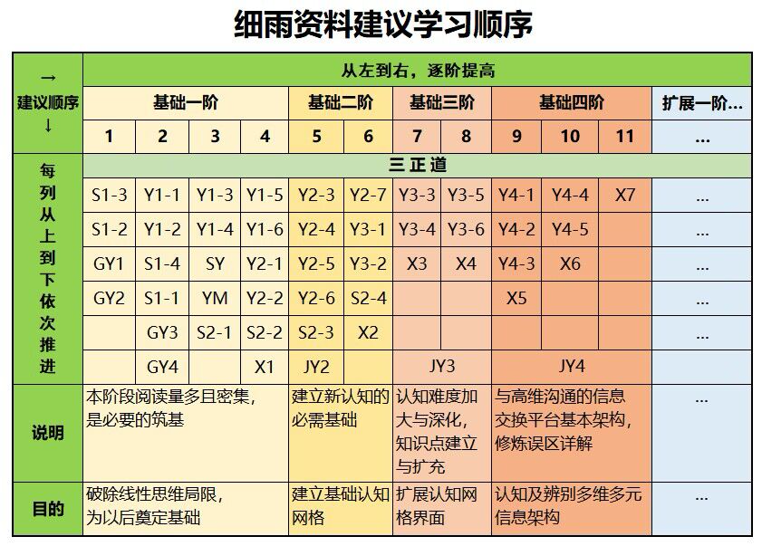

# 这里是细雨社提供的公共资源.

> 细雨社由作者“细雨”授权，专门负责细雨资料的出版、传播和保存，并具有维护其版权的责任与义务。        
细雨系列文字的版权归细雨所有。经作者授权由细雨社代为发表并授权分发。
细雨社是编辑、出版、发行全部细雨著作和其衍生品的唯一首发机构。

    1. 亚马逊全球网站为细雨资料的文字版权依据。

    2. Youtube“细雨社”频道为细雨资料有声书唯一首发平台，并声明视频和音频版权。

    3. 微信公众号“细雨资料”和“细雨资料 觉心接力”为中国境内文字的首发平台并声明原创。
> 以上原创发布平台均可作为下载、转载、转发途径。

> 欢迎所有人共同传播宣传已正式出版发行的各类型细雨资料。一切资料为共享资源，请全文全片转载并注明出处。不要添加或节选文字，导致带来不必要的认知扭曲。  
在此代表全体细雨社编辑制作人员感谢读者对我们的付出给予认可与关注。
公益非营利频道。 所用的部分图片影像来自网络，目的仅为帮助读者理解内容，无意侵犯版权，如果必要请即时联系版主修正。
细雨社坚守非营利、无住相的法布施原则，愿和大家一起通过自己的内在热忱和努力，携手互助，共同学习，合力让广大渴望得到中正灵性引导的朋友们，获得自己急需的心灵滋养和认知矫正，打开各自的觉悟，并在这个过程中走向自我价值的最终完成。

# 细雨资料学习建议

 
## 联系
### Helen QQ: 1138055932  
### 细雨社志愿者Q群：623940583
### email地址：xiyushe@outlook.com

### Youtube频道: https://www.youtube.com/@xiyushe
 

## 备用地址
### github    https://github.com/helenwinston/xiyushe
### gitee     https://gitee.com/helenwinston/xiyushe 
### gitcsdn   https://gitcode.net/Xiyushe/xiyushe
### gitcode   https://gitcode.com/xiyushe/xiyushe 
 
 